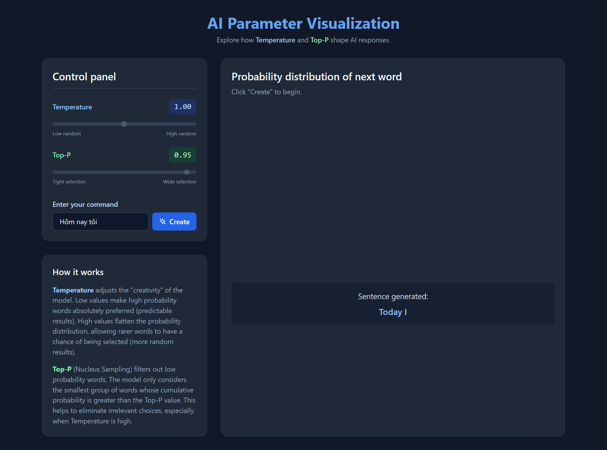

# Interactive AI Parameter Visualizer

This project is an interactive web application designed to help users understand the effects of two key parameters in AI language models: **Temperature** and **Top-P (Nucleus Sampling)**. By adjusting these parameters and generating text, users can visually see how the probability distribution of the next word changes, providing an intuitive grasp of these fundamental concepts.

[](https://app.netlify.com/sites/YOUR_NETLIFY_SITE_NAME/deploys)

**[➡️ View Live Demo](https://your-netlify-site-name.netlify.app/)** 👈 *(Replace with your actual Netlify link after deployment)*


*(It's recommended to add a screenshot of your application and name it `screenshot.png`)*

## Features

-   **Interactive Sliders**: Easily adjust Temperature and Top-P values with real-time feedback.
-   **Dynamic Visualization**: A bar chart, built with D3.js, visualizes the probability distribution of potential next words.
-   **Color-Coded Feedback**: The chart clearly distinguishes between candidate words (considered for selection), eliminated words (filtered out by Top-P), and the final selected word.
-   **Real-time Updates**: The chart and probability calculations update instantly as you change the sliders.
-   **Text Generation Simulation**: Click "Generate" to see the model select a word based on the current settings and append it to the input text.
-   **Responsive Design**: The layout is optimized for both desktop and mobile devices.
-   **Educational Explanations**: Clear, concise descriptions of how Temperature and Top-P work are included directly in the UI.

## How It Works

The application simulates the final step of a language model's text generation process.

1.  **Base Probabilities**: The simulation starts with a predefined set of words (the vocabulary) and their base probabilities for following the input text "Hôm nay tôi".
2.  **Temperature**: The **Temperature** slider controls the randomness of the predictions.
    -   **Low Temperature (< 1.0)**: The model becomes more confident and deterministic, heavily favoring the most likely words. The probability distribution becomes "sharper."
    -   **High Temperature (> 1.0)**: The model takes more risks and becomes more creative. The probabilities of less likely words are increased, making the distribution "flatter."
3.  **Top-P (Nucleus Sampling)**: The **Top-P** slider filters the vocabulary to a smaller set of the most probable words.
    -   It sorts words by their probability and selects the smallest possible set whose cumulative probability is greater than the `top_p` value. This prevents the model from choosing highly improbable or irrelevant words, especially when the temperature is high.
4.  **Selection**: After applying Temperature and Top-P, the application randomly samples a word from the remaining pool of candidates, weighted by their adjusted probabilities.

## Technologies Used

-   **HTML5**: For the basic structure of the web page.
-   **CSS3**: For custom styling and layout.
-   **[Tailwind CSS](https://tailwindcss.com/)**: A utility-first CSS framework for rapid UI development.
-   **[JavaScript (ES6+)](https://www.javascript.com/)**: For all the core logic, including calculations and DOM manipulation.
-   **[D3.js](https://d3js.org/)**: A powerful JavaScript library for creating dynamic, data-driven visualizations.

## Project Structure

The project is organized into three separate files for better maintainability:

```
.
├── index.html      # The main HTML file
├── styles.css      # Custom CSS styles
├── script.js       # All JavaScript logic and D3 visualization code
└── README.md       # This file
```

## How to Run Locally

Since this is a static web application with no backend or build process, you can run it very easily:

1.  Clone this repository:
    ```bash
    git clone https://github.com/your-username/your-repo-name.git
    ```
2.  Navigate to the project directory:
    ```bash
    cd your-repo-name
    ```
3.  Open the `index.html` file directly in your web browser (e.g., Chrome, Firefox, Safari).

That's it! The application will be fully functional.

## Deployment

This project can be deployed to any static site hosting service. It is perfectly suited for platforms like:

-   **[Netlify](https://www.netlify.com/)**: Simply drag and drop the project folder into the Netlify UI.
-   **[Vercel](https://vercel.com/)**: Connect your GitHub repository for automatic deployments.
-   **[GitHub Pages](https://pages.github.com/)**: Deploy directly from your GitHub repository.

No build configuration is needed.